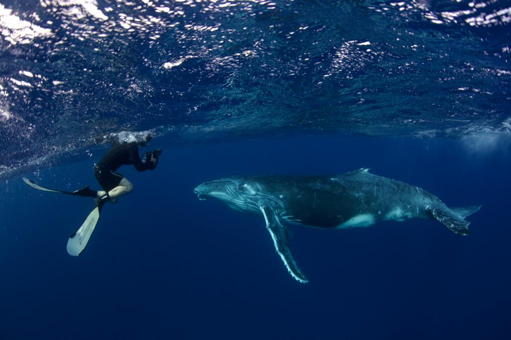
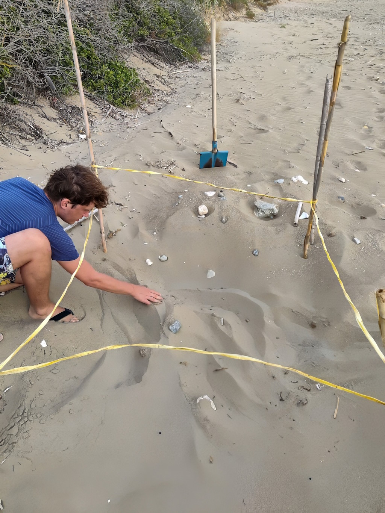
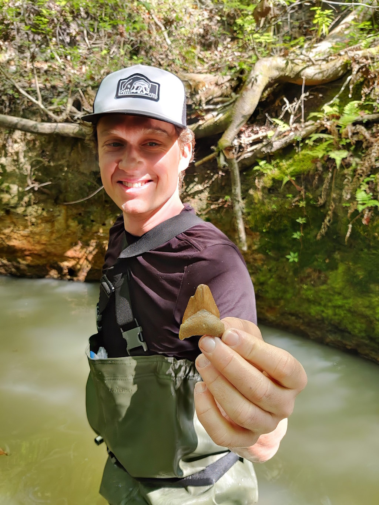

# Bernt Popp

🔬 **Human Genetics Researcher** - Passionate about unraveling the mysteries of genetics and contributing to advancements in medical science.

## 🌐 Quick Links
- [Google Scholar Profile](https://scholar.google.com/citations?user=Uvhu3t0AAAAJ)
- [Twitter/X Profile](https://twitter.com/berntpopp)
- [ORCID Profile](https://orcid.org/0000-0002-3679-1081)
- [GitHub Profile](https://github.com/berntpopp)
- [Personal website](http://www.berntpopp.com/)
- Location: [BIH Charité – Universitätsmedizin Berlin, Berlin, Germany]

## 📖 Background
I was born in a small Romanian town. My mother is a Transylvanian Saxon, and my father is Romanian. Nature, genetics, and the evolution of DNA, a thread that connects all life on Earth, have always captivated me. My interest in technology and computers began in the late 1990s with a family-owned computer, where I learned to code in Basic. During my medical studies, I discovered the field of human genetics, which provided a way to combine these interests.
My journey in this field has been marked by pivotal moments, like securing my [first DFG project](https://gepris.dfg.de/gepris/projekt/422575385), being honored with the ["GfH-Promotionspreis" 2017](https://gfhev.de/de/ueber-uns/ehrungen.html), and the SYNLAB-award at EuroDysmorpho 2019, each milestone propelling me further into the exploration of genetic landscapes and bioinformatics.

## 💼 Professional Experience
- Currently working at BIH Charité Berlin and LaborBerlin, focusing on rare diseases of neuronal development, rare tumors, and kidney diseases.
- Senior Physician at Charité – Universitätsmedizin Berlin, Translational Research Area - Research Group "Hypertension and Molecular Biology of Endocrine Tumors" since 07/2022.
- Previously Senior Physician and Head of the Genetics Outpatient Clinic at MVZ Dresden.
- Specialist in Human Genetics at the Institute of Human Genetics, University of Leipzig Medical Center, and Deputy Team Leader Genetic Diagnostics - Clinical Genomics.
- DFG Rotation Position at the Human Genetics Institute of the University Hospital Leipzig, working on the project "Exome Pool-Seq and systems biology approach to identify and characterize genes and networks in neurodevelopmental disorders".
- Previously Resident and scientific-medical assistant at the Institute of Human Genetics, University Hospital Erlangen, Friedrich-Alexander-Universität Erlangen-Nürnberg (FAU), Erlangen, Germany.

## 🌱 Other Interests
Nature, science, and technology also play a big role in my personal life. I enjoy freediving, scuba diving, being in nature and I am a passionate photographer. Most recent hobby is finding fossil shark teeth around the world.

I love traveling and experiencing new things, trying to involve in local communities, cultures and citizen science.

### 🐋 Favorite Animals
Favorite animals: sharks 🦈, whales 🐋, and turtles 🐢.

Photographing a baby humpback whale in Moorea, French Polynesia.

Checking a nest of loggerhead sea turtles (Caretta caretta) for signs of hatchlings on the island of Kefalonia in Greece.

Very happy after finding my first Megalodon tooth in Gainsville, Florida.

## 🏆 Achievements
- Spearheaded [SysNDD](https://github.com/berntpopp/sysndd), a robust platform for analyzing gene-disease relationships in neurodevelopmental disorders (NDD).
- Established [MorbidGenes](https://github.com/berntpopp/morbidgenes), providing a monthly updated list of diagnostically relevant genes to advance genetic diagnostics.
- Developed [HNF1B-db](https://github.com/berntpopp/HNF1B-db), a dedicated database for HNF1B variant annotations.
- Contributed to [AutoCaSc](https://github.com/JohannKaspar/AutoCaSc), an automated variant curation system, showcased in a recent [publication](https://onlinelibrary.wiley.com/doi/10.1002/humu.24451) in Human Mutation.
- Involved in [Kidney-Genetics](https://github.com/halbritter-lab/kidney-genetics), a project dedicated to understanding the genetic underpinnings of kidney diseases, with comprehensive [documentation](https://halbritter-lab.github.io/kidney-genetics/).

## 👨‍💻 Coding Experience
- Languages: R, SQL, Bash, Python, JavaScript, HTML, CSS
- Technologies: Docker, GitHub, Nextflow, SnakeMake

## 🎓 Academic Background
- Dissertation Dr. med. at the Institute of Human Genetics, University Hospital Erlangen, Title: "De novo missense mutations in the NAA10 gene cause severe non-syndromic developmental delay in males and females" (summa cum laude), 05/2019 - 02/2013.
- License as a physician after completing medical studies at the FAU Erlangen-Nuremberg, 11/2012.

## 📬 Contact
- 📧 bernt.popp[at]charite.de | bernt.popp.md[at]gmail.com

> Disclaimer: Any opinions expressed here are solely my own and do not reflect the views of my employer, funders, or their affiliates.
