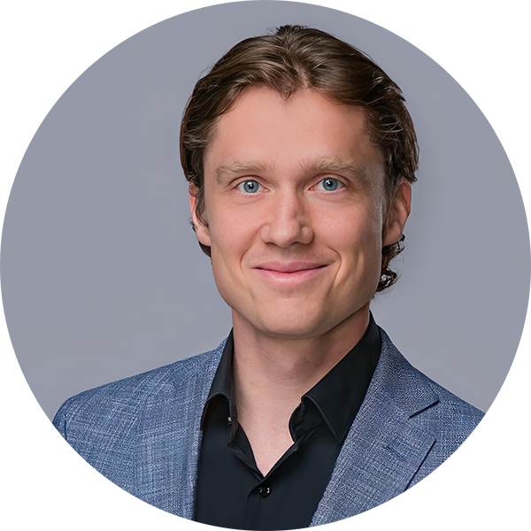

<!-- here we load required libraries -->
```{r setup, include=FALSE}
knitr::opts_chunk$set(echo = TRUE)
## Load libraries
library(knitr)
```

***

::: columns

:::: column
<div style="max-width:250px; padding:10px;">

</div>

## Profile
Medical professional, board-certified geneticist, Senior Physician & Postdoctoral Research Fellow

### Links
- [Google Scholar Profile](https://scholar.google.com/citations?user=Uvhu3t0AAAAJ)
- [Twitter/X Profile](https://twitter.com/berntpopp)
- [ORCID Profile](https://orcid.org/0000-0002-3679-1081)
- [GitHub Profile](https://github.com/berntpopp)

### Projects
- [SysNDD](https://sysndd.org)
- [Kidney-Genetics](https://kidney-genetics.org)
- [MorbidGenes](https://morbidgenes.org)
- [AutoCaSc](https://autocasc.uni-leipzig.de/)

::::

:::: column
## Biography
As a *board*-certified genetics specialist with extensive experience, I am currently employed at BIH Charité – Universitätsmedizin Berlin, Germany. My scientific interests in human genetics include rare diseases of neuronal development, rare tumors, and the kidney. I particularly enjoy bioinformatics work involving high-throughput sequencing data analysis and the curation of genetic diseases, variants, and genes. <br><br>
My academic journey began at FAU Erlangen-Nürnberg and culminated in a medical license. I was a scientific-medical assistant at the Institute of Human Genetics, University Hospital Erlangen, Friedrich-Alexander-Universität Erlangen-Nürnberg (FAU) after beginning my residency. Here, I submitted an application for a DFG Rotation Position, which I was awarded after transferring to the Human Genetics Institute of the University Hospital Leipzig and working on the project "Exome Pool-Seq and systems biology approach to identify and characterize genes and networks in neurodevelopmental disorders". <br><br>
 I completed my Specialization in Human Genetics at the Institute of Human Genetics, University of Leipzig Medical Center, where I also served as Deputy Team Leader of Genetic Diagnostics - Clinical Genomics. Soon after completing my specialization, I took a position as Senior Physician and Head of the Genetics Outpatient Clinic at MVZ Dresden.
::::

:::
***